# Inkspire

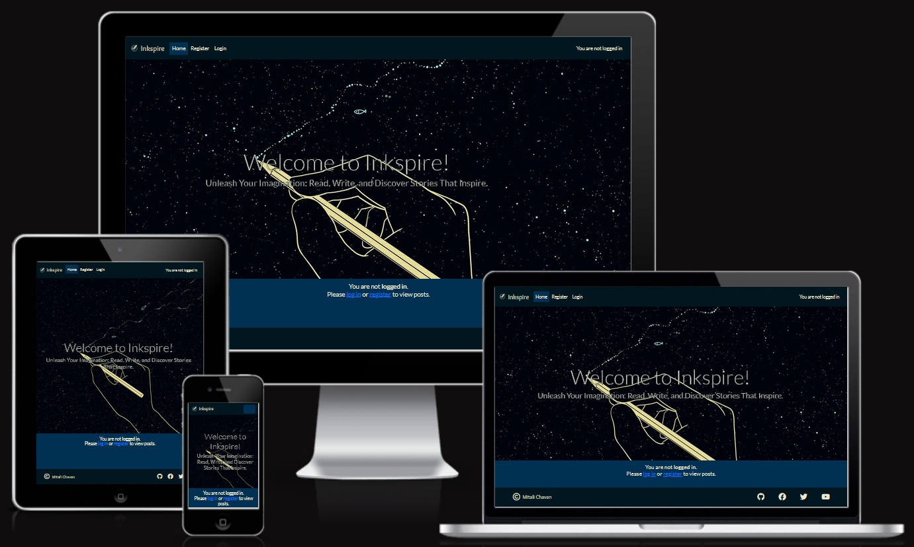

<p align="center">
| <a href="https://inkspire-17c10e106355.herokuapp.com/" target="_blank">Live Project</a> |
</p>

<a id="overview"></a>
## Overview
Inkspire is a assessed portfolio project developed as part of the Code Institute Full Stack Software Developer Bootcamp.
The intention of this project was to create an responsive website built with Django where users can read stories and submit their own writing to be published on the site.

The users can register an account and login to browse through published stories and leave comments on posts to share their thoughts. The website also includes a submission form where users can send their own stories to be approved and displayed.


## Contents
- [Overview](#overview)
- [UX](#user-experience)
  - [User Stories](#user-stories)
  - [Wireframes](#wireframes)
- [Design](#design)
  - [Topography](#topography)
  - [Colour Scheme](#colour-scheme)
- [Features](#features)
- [Database](#database)
- [Agile](#agile)
- [Testing](#testing)
  - [Verification & Validation](#valid-test)
  - [Manual Testing](#manual-test)
  - [Automated Testing](#auto-test)
  - [Known Bugs](#bugs)
- [Future Features](#future-features)
- [AI Implementation](#ai-implementation)
  - [Use Cases & Reflections](#ai-use)
  - [Code Creation](#ai-code)
  - [Debugging](#ai-debug)
  - [Asset Generation](#ai-assets)
  - [Automated Unit Testing](#ai-test)
  - [Overall Impact](#ai-impact)
- [Technology Used](#tech-used)
- [Deployment](#deployment)
  - [Security Measures](#security)
- [Credits](#credits)


<a id="user-experience"></a>
## UX (User Experience)

<a id="user-stories"></a>
### User Stories
- As a user I can view the landing page so that access the website. `Must Have`
- As a user I can register an account and login to the site so that view posts. `Must Have`
- As a user I can view a list of posts so that I can select which post I want to view. `Must Have`
- As a user I can click on a post so that I can view the whole post. `Must Have`
- As a user I can view comments on an individual post so that I can read opinions on the post. `Must Have`
- As a user I can leave comments on a post so that I can share my opinion about the post. `Must Have`
- As a user I can edit or delete my comments so that change my comments. `Must Have`
- As an admin I can create, read, update and delete posts so that I can manage the content on the website. `Must Have`
- As an admin I can create draft posts so that I can finish writing the content later. `Must Have`
- As an admin I can delete any comments so that I can moderate the website. `Should Have`
- As a user I can submit content so that it will be displayed on the website. `Could Have`

- As a user I can like posts so that I can view them later. `Won't Have`
- As a user I can view an account page so that I can see my account details. `Won't Have`
- As a user I can search for post titles so that I can find specific posts. `Won't Have`
- As a user I can click the author name so that I can see other posts by the same author. `Won't Have`
- As a user I can add new cover images so that I can personalise posts I submit. `Won't Have`

<hr>

<a id="wireframes"></a>
### Wireframes
Wireframes for all pages of the website were created before coding began. Versions for desktop, tablet and mobile size were created to reflect the responsive design expected. 

For the most part, the designs remained consistent with the implementation, but some minor formatting changes were made in the final version.

- **Landing Page**

<details>
<summary>Click to see Landing Page Wireframes</summary>

- Desktop Logged Out
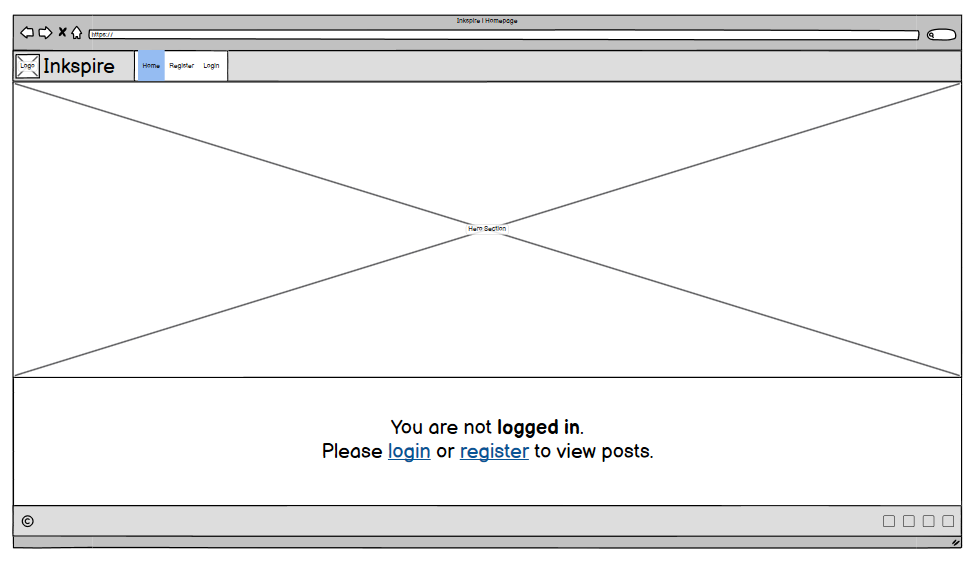

- Desktop Logged In
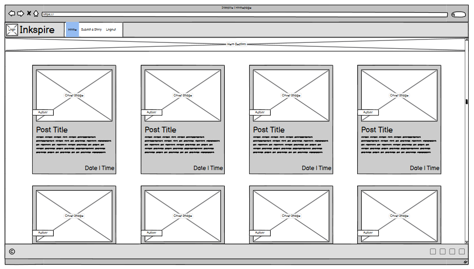

- Tablet
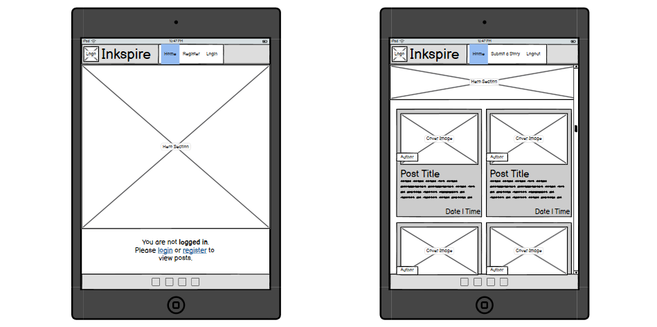

- Mobile
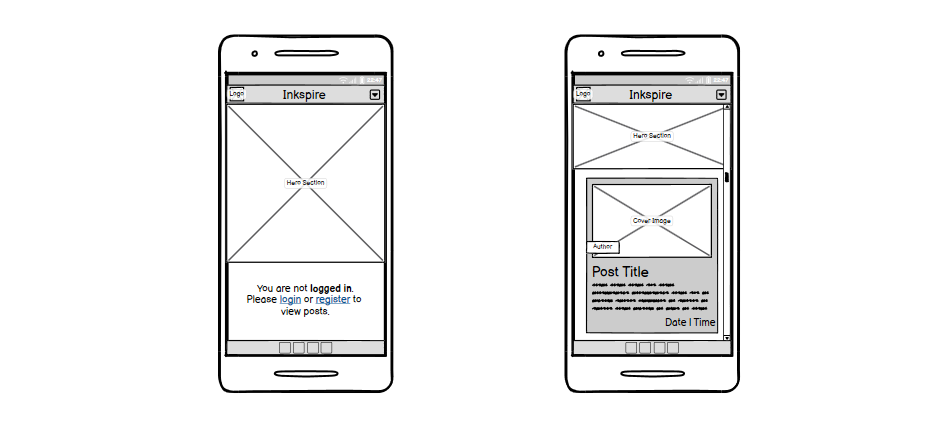

</details>

- **Registration Page**

<details>
<summary>Click to see Registration Page Wireframes</summary>

- Desktop
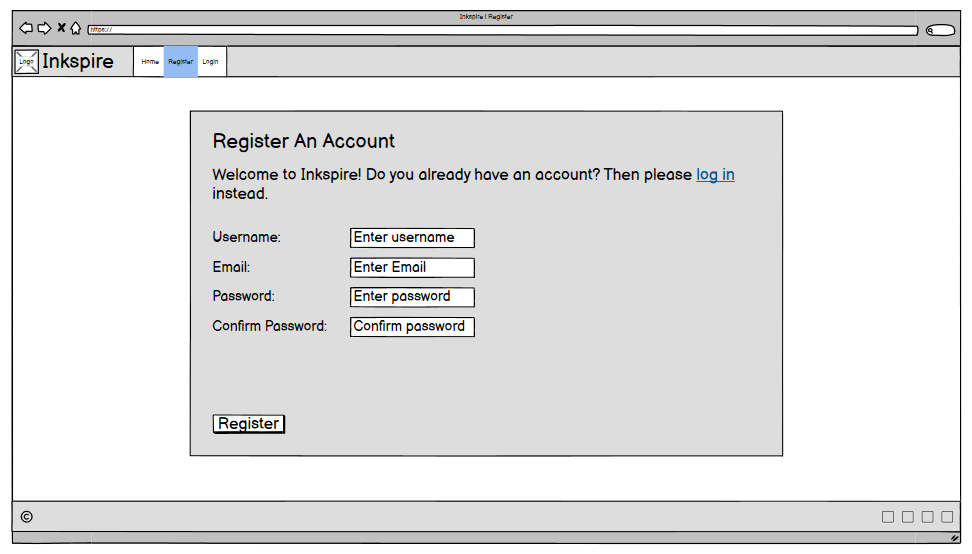

- Tablet & Mobile
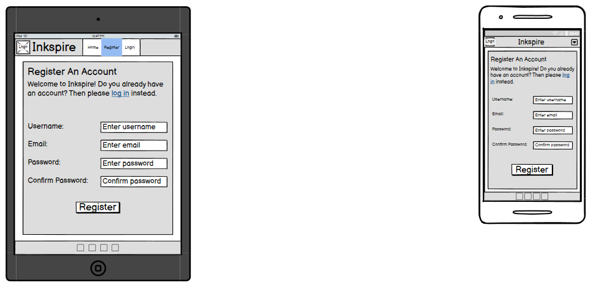

</details>

- **Login Page**

<details>
<summary>Click to see Registration Page Wireframes</summary>

- Desktop
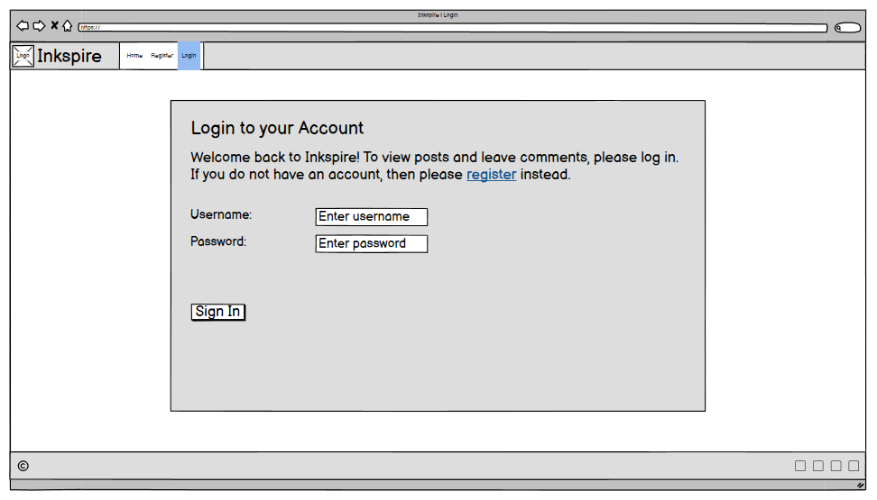

- Tablet & Mobile
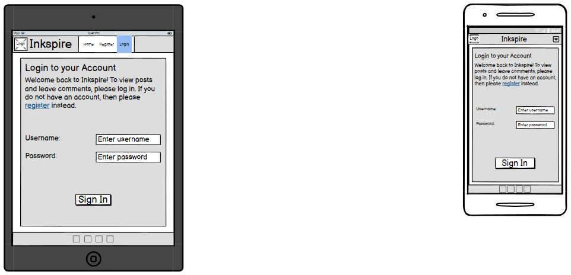

</details>

- **Post Detail Page**

<details>
<summary>Click to see Post Detail Page Wireframes</summary>

- Desktop
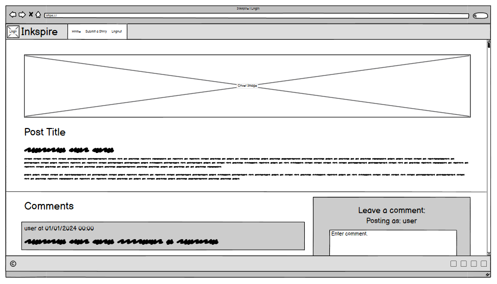

- Tablet & Mobile
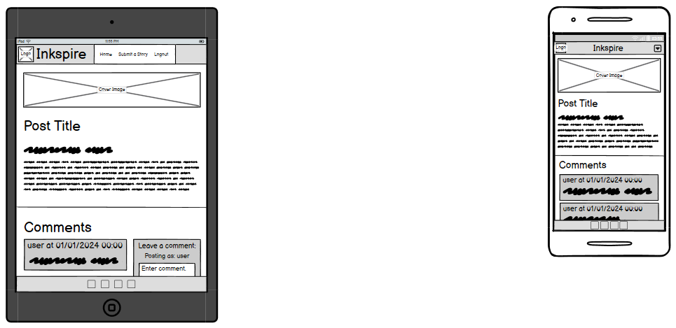

</details>

- **Submission Form Page**

<details>
<summary>Click to see Submission Form Page Wireframes</summary>

- Desktop
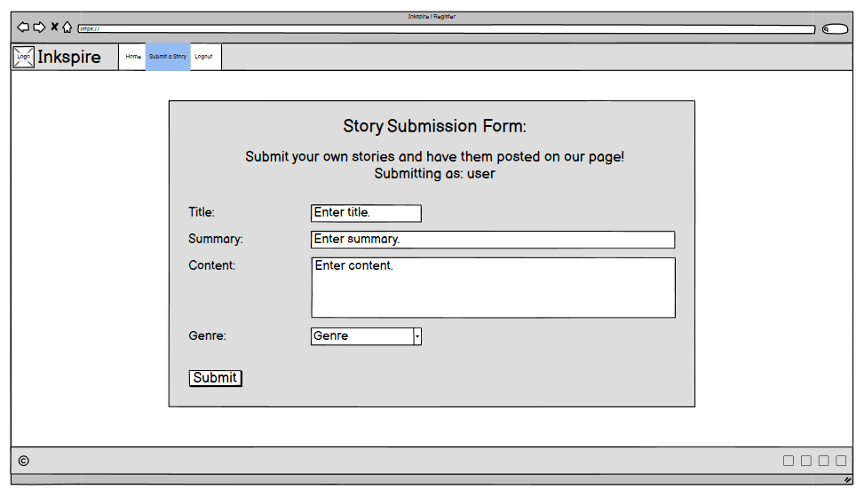

- Tablet & Mobile
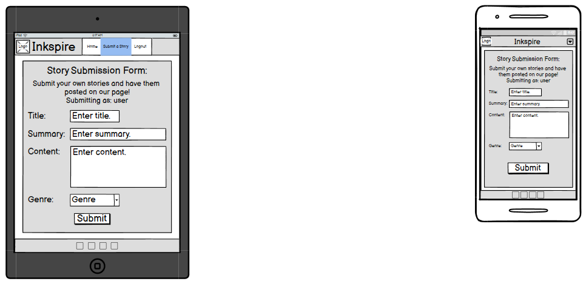

</details>


<a id="design"></a>
## Design

<a id="topography"></a>
### Typography

The project used two sans-serif fonts which were implemented via [Google Fonts](https://fonts.google.com).

- [Overlock](https://fonts.google.com/specimen/Overlock) was used as the main logo and heading font to make it stand out and fit with the theme of the website.
- [Lato](https://fonts.google.com/specimen/Lato) was used for all the links and main content of the website. As the website is focused on allowing users to read stories, it was important to pick a font which ensured easy readability.

<hr>

<a id="colour-scheme"></a>
### Colour Scheme

The colours used were taken from [Coolors](https://coolors.co/). Contrasting colours were used for the background, text and other elements (like buttons and info cards) to make the website easier to read and interact with. Below is a breakdown of where the respective colours were used throughout the website.

6A513B Coffee:		
- `#01161E` (Rich Black) used for: header & footer backgrounds, main font
- `#003052` (Prussian Blue) used for: main background, button hover background
- `#A50021` (Madder) used for: delete button hover background, author labels on posts 
- `#F1E9D2` (Parchment) used for: post background, header & footer font, headings font, button text
- `#DACDB2` (Dun) used for: comment background
- `#C3B091` (Khaki) used for: comment background for author of post
- `#4B3621` (Cafe Noir) used for: button background


Both the fonts and colours were defined as `:root` variables so they could be easily referenced throughout the project and stylesheets.

```css
:root {
    --heading-font: "Overlock", serif;
    --text-font: "Lato", sans-serif;
    --rich-black: #01161E;
    --bg-blue: #003052;
    --link-red: #A50021;
    --parchment: #F1E9D2;
    --cmt-op-bg: #C3B091;
    --cmt-bg: #DACDB2;
    --bg-brown: #4B3621;
}
```

<a id="features"></a>
## Website Features

The website was creating using Django and included several templates which extended from a base template to ensure consistency across pages in the website and provide a good user experience. All features on the website were implemented using a combination of HTML5, CSS (including Bootstrap), JavaScript and Python. The site is responsive on multiple device sizes in accordance with appropriate breakpoints.

- Header Navigation Bar
  - A sticky navigation bar on all pages with the logo and website title which redirects to the homepage
  - Links to other pages on the website
  - Links change depending on whether user is logged in or not
  - Message in header showing whether user is logged in or not


- Responsive Hero Section on Landing Page
  - Introduction to the website
  - Responsive in accordance with appropriate breakpoints
  - Main page seen when both logged in and logged out


- Registration/Login
  - Users can create accounts and login
  - Logged out users not will only be able to see the landing page
  - Logged in users be able to access the rest of the website pages as well
  - Prompt to register/login on landing page
  - Separate pages for registration and log in, with authentication created using Django models
  - Message notifications will be shown after you have registered/logged in


- List of Published Posts
  - When logged in, users can see a list of published posts on the landing page
  - 6 posts are displayed at a time, ordered by date created with the most recent showing first
  - Navigation is provided to look through the list of posts
  - All posts display the title, author and date created
  - All posts display a header image depending on what genre they are classified as


- Post Display
  - Users can select specific posts to view them fully in a separate page
  - Post display has a header with the title, author, date created and summary shown at the top left
  - Cover image based on genre is also shown in the header
  - The story content is displayed below the header in it's own section
  - There is a comments section under every story


- Comments Section
  - Individual comments sections are displayed under every post
  - Users can see all approved comments
  - Users have the option to edit or delete their own comments
  - Deleting comments will prompt users with a confirmation message
  - Users can also create new comments and will recieve a message to confirm their comment has been submit
  - Submit comments will have to be approved by admins before they can be seen by all users on the site


- Submission Form
  - There is a submission form page for users to submit their own stories
  - Users will recieve a message to confirm their story has been submit
  - Submit stories must be approved before they are displayed in the post list on the landing page


- Admin Panel
  - Admin users can access an admin site where they can view all users, stories and comments to moderate them
  - Admins can add stories and comments through the admin site
  - Admins can approve new and edited comments and submit posts before they are displayed on the website


- Logout
  - Users can logout of their accounts after they are done with their session
  - Clicking the log out link will redirect the user to a confirmation page
  - Message notification will be shown after you have logged out


- Footer
  - Copyright details
  - Links to GitHub repository and social media sites


<a id="database"></a>
## Database

Code Institute's PostgreSQL database was used for this project.

### Entity Relationship Diagrams

ERDs for the database models were created prior to the start of the project and were used to inform it's development and structure.
The User model was built using the Django Allauth Library.

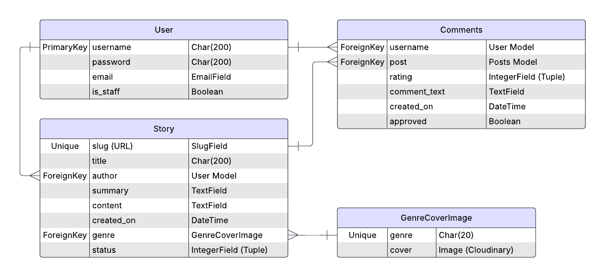
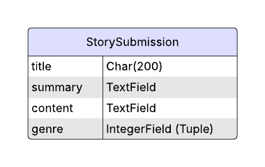


<a id="agile"></a>
## Agile

### GitHub Project Board

[Project Board Link](https://github.com/users/mitalic004/projects/2)

The GitHub project board was used as an Agile tool for this project. All User Stories were added to the board and broken down into smaller tasks to help improve the workflow for the duration of the project.

### MoSCoW Prioritization

All user stories were created prior to beginning the project and were prioritized to ensure a suitable MVP was created before adding additional funtionality. The MoSCoW prioritization was used to sort user stories and the appropriate labels were applied on the issues in the project board.

All user stories marked `Must Have`, `Should Have` and `Could Have` were completed and additional features not in the scope were marked as `Won't Have` and included in the future features section.


<a id="testing"></a>
## Testing
Validation of HTML/CSS/JavaScript/Python, Lighthouse Audits, Bugs

<a id="valid-test"></a>
### Verification & Validation
#### Google Lighthouse Testing

Good scores were achieved for both Desktop and Mobile when passing through the official [Google Lighthouse](https://pagespeed.web.dev/)

- Desktop
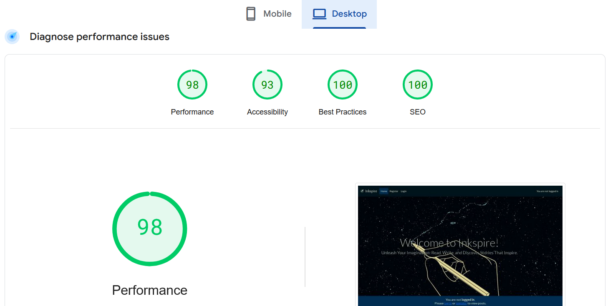

- Mobile
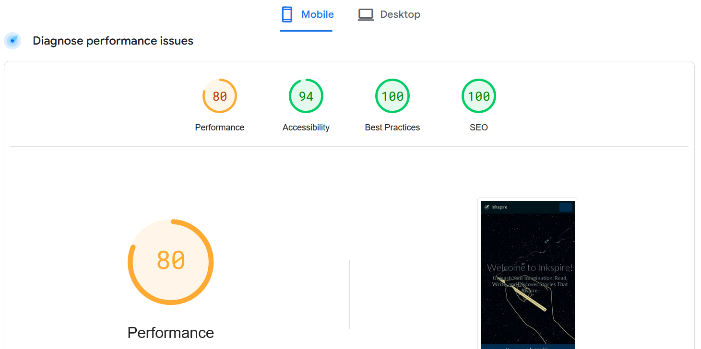

<hr>

#### Validation Testing

- HTML
  - All HTML pages were passed through the official [W3C validator](https://validator.w3.org/nu/)
  - All error listed were caused by using Django block templates to create the HTML pages and cannot be changed.
  - There were no errors apart from these.

<details>
<summary>Click to HTML Validation</summary>

- base.html
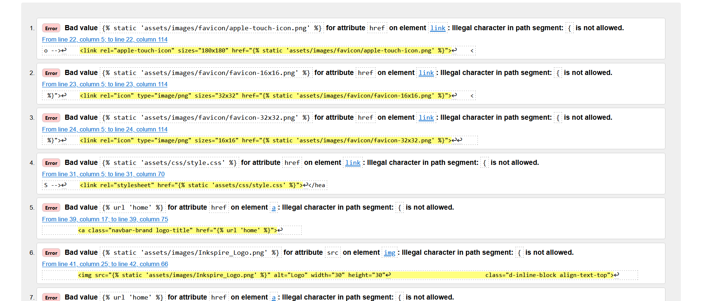

- index.html
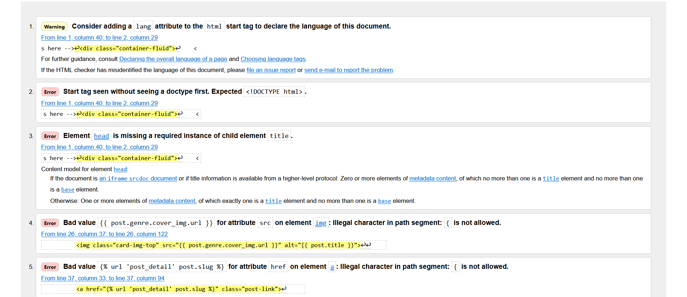

- post_detail.html
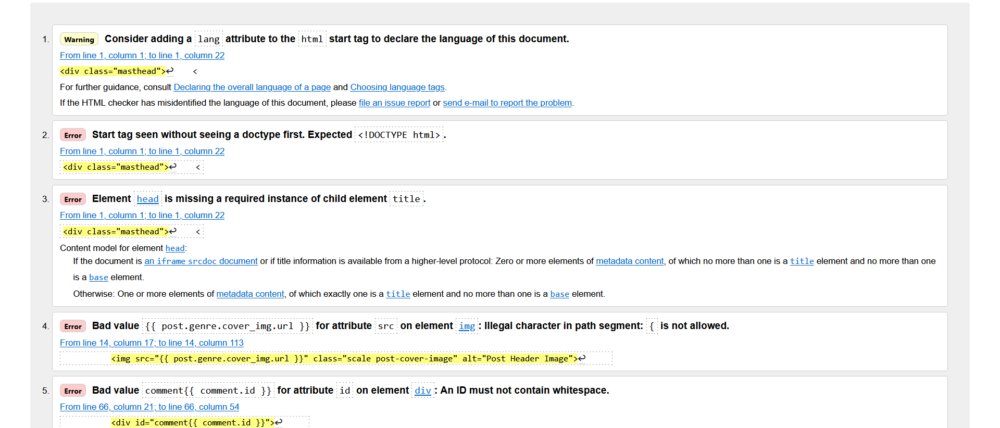

- submission.html
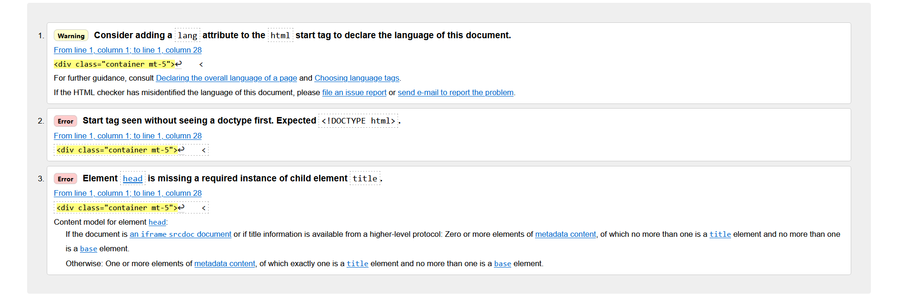

</details>

- CSS
  - No errors were found when passing through the official [(Jigsaw) validator](https://jigsaw.w3.org/css-validator/)

<details>
<summary>Click to CSS Validation</summary>

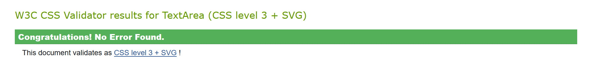

</details>

<hr>

- JavaScript
  - No errors were found when passing through the official [JSHint validator](https://jshint.com/)
  - Some warnings were made, but most were regarding different versions of JavaScript

<details>
<summary>Click to JavaScript Validation</summary>

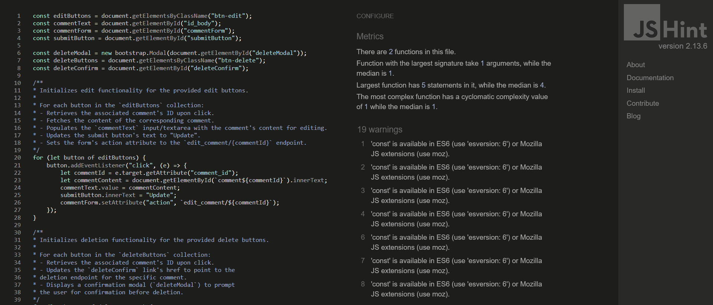

</details>

<hr>

- Python
  - All python pages were passed through the [CI Python Linter](https://pep8ci.herokuapp.com/)
  - No errors were found

<details>
<summary>Click to Python Validation</summary>


- inkspire/urls.py
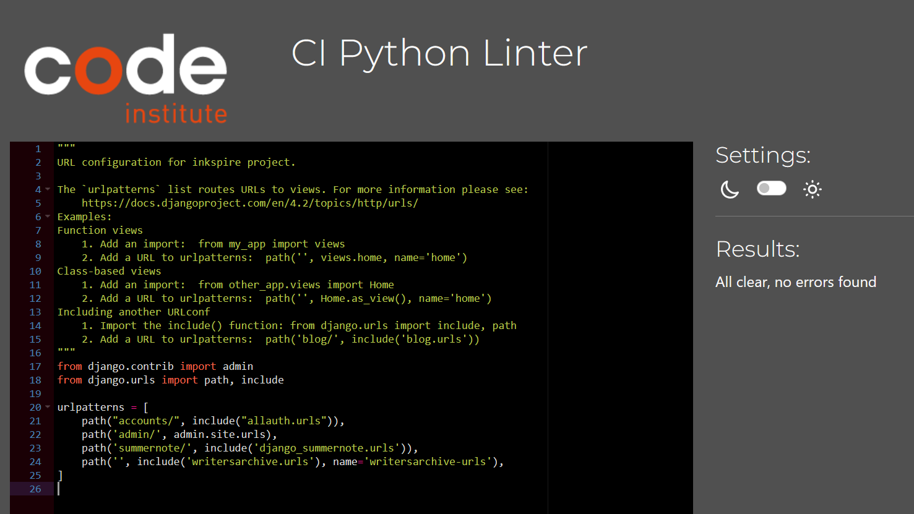

- writersarchive/urls.py
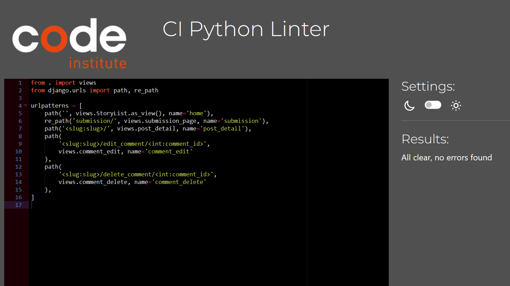

- admin.py
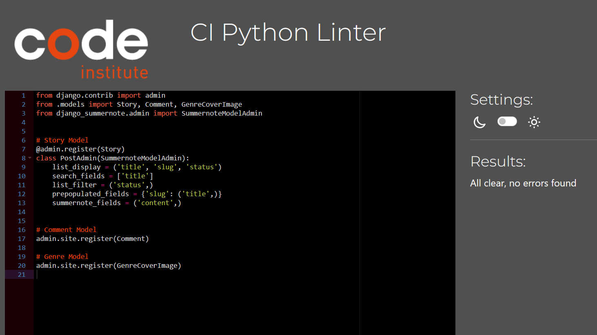

- apps.py
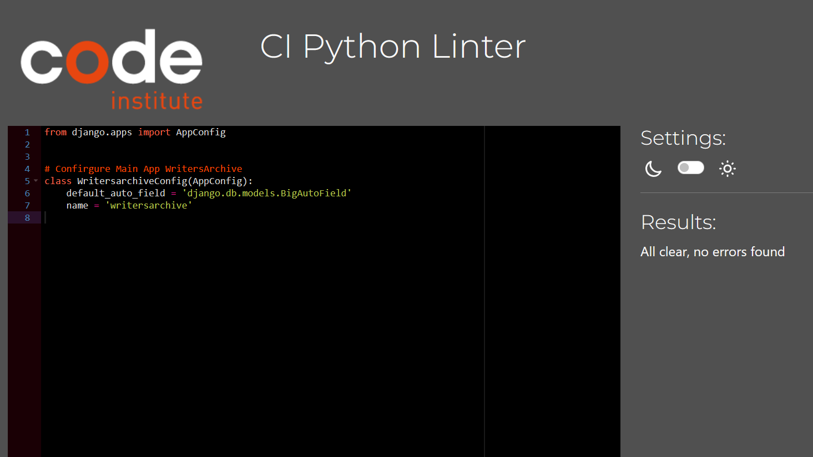

- models.py
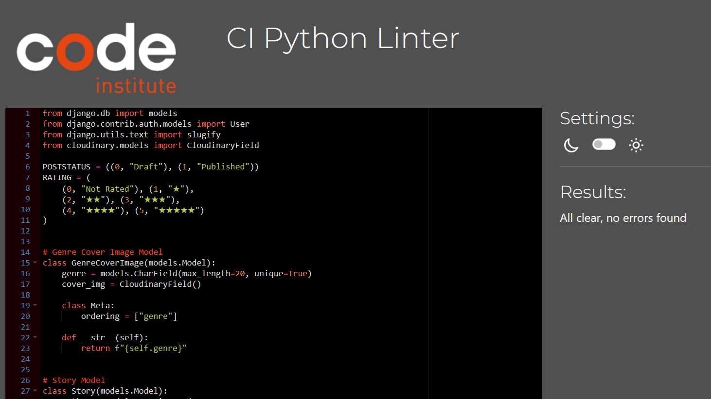

- views.py
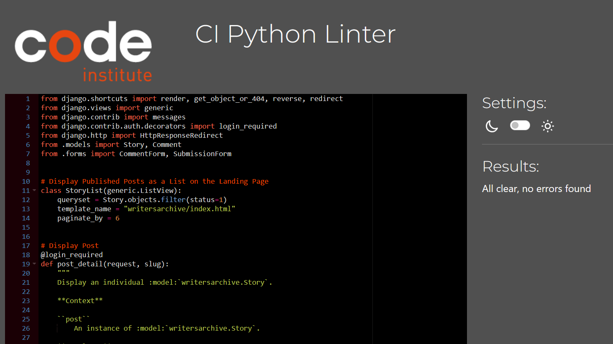

- forms.py
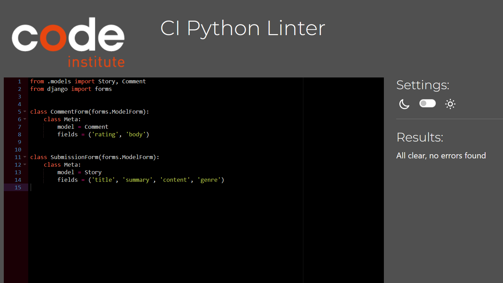

- test_forms.py
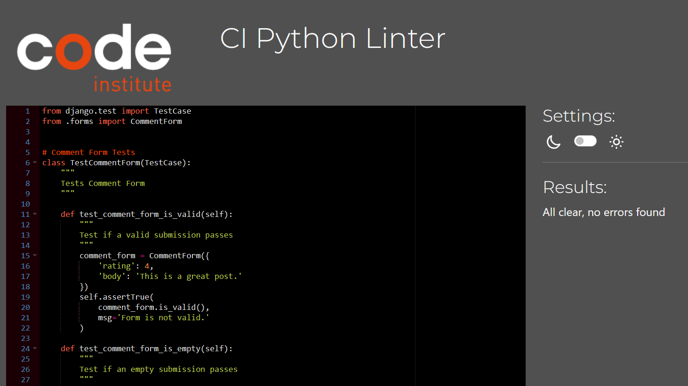


</details>


<hr>

<a id="manual-test"></a>
### Manual Testing

Manual testing was carried out throughout the development of the project.

| Function | Expected Outcome | Pass/Fail |
| ----------- | ----------- | ----------- |
| General - Header | The header is displayed at the top of the page and sticks there. | Pass |
| General - Logo Link | The logo and title direct the user to the homepage when clicked. | Pass |
| General - NavBar | The NavBar links direct the user to the relevant pages when clicked. | Pass |
| General - NavBar Change Links | The NavBar links change depending on whether the user is logged in or not. | Pass |
| General - NavBar Registration | The Registration link opens the Registration page when clicked. | Pass |
| General - NavBar Login | The Login link opens the log in page when clicked. | Pass |
| General - Login Page | The Login page allows the user to sign in. | Pass |
| General - Login Page Authentication | The Login page validates and authenticates the user's details. | Pass |
| General - Login Page Registration Link | The Login page redirects to the Registration page when clicked. | Pass |
| General - Login Confirmation | The page will show a success message to inform the user after successfully logging in. | Pass |
| General - Registration Page | The Registration page allows the user to sign in. | Pass |
| General - Registration Page Authentication | The Registration page validates and authenticates the user's details. | Pass |
| General - Registration Page Registration Link | The Registration page redirects to the Login page when clicked. | Pass |
| General - Registration Confirmation | The page will show a success message to inform the user after successfully registering. | Pass |
| General - Logout Confirmation | The logout confirmation page is shown when logging out. | Pass |
| General - Logout Confirmation | The page will show a success message to inform the user after successfully logging out. | Pass |
| General - Page Reset | The page reloads after logging out. | Pass |
| General - Footer | The footer is displayed at the bottom of the page and shows social media links and a copyright. | Pass |
| General - Footer Links | The social media links direct the user to the relevant websites when clicked. | Pass |
| General - Footer Links New Page | The social media links open in new pages. | Pass |
| General - Responsivity | The website is responsive and changes format depending on the device size. | Pass |
| Homepage - Hero Section | The hero section is displayed with a background image, text overlay. | Pass |
| Homepage - User Authentication | The homepage doesn't show any posts when user is not logged in. | Pass |
| Homepage - Login Prompt | The homepage displays a registration/login prompt when user is not logged in. | Pass |
| Homepage - Post List | The posts are displayed in a list view when user is logged in. | Pass |
| Homepage - Post List Navigation | There is are navigation links allowing you to go through the list of posts at the bottom of the page. | Pass |
| Homepage - Posts | The posts are displayed with all relevant information and a header image. | Pass |
| Homepage - Post List Links | The posts will redirect to a page showing post details when clicked. | Pass |
| PostDetails - Posts | The posts are displayed with all relevant information and a header section. | Pass |
| PostDetails - Posts Header | The header section contains all relevant information and a image based on the genre. | Pass |
| PostDetails - Comments Section | The comments section is displayed under the post. | Pass |
| PostDetails - Comments Approved | The comments section will only display approved comments. | Pass |
| PostDetails - Add Comments | Users can submit comments using the comment box form. | Pass |
| PostDetails - Input Validation | The input boxes validates the user's input to ensure data is in the correct format. | Pass |
| PostDetails - Edit Comments | Users can edit their own comments using the comment box form. | Pass |
| PostDetails - Delete Comments | Users can delete their own comments. | Pass |
| PostDetails - Delete Comments Confirmation | The page will show a confirmation message to check the user wants to delete their comment. | Pass |
| PostDetails - Interact Only With Own Comments | The page will not allow users to edit or delete other's comments and will show a warning message if attempted. | Pass |
| SubmissionForm - Input Validation | The input boxes validates the user's input to ensure data is in the correct format. | Pass |
| SubmissionForm - Submit Confirmation | The page will show a success message to inform the user the submission has been sent. | Pass |
| SubmissionForm - Form Reset | The form resets after the submission has been sent. | Pass |
| Admin - Admin Panel | Admin users can access a separate admin panel to moderate users, stories and comments. | Pass |
| Admin - Draft Posts | Admin users can create drafts of stories. | Pass |
| Admin - Publish Posts | Admin users can publish stories. | Pass |
| Admin - Submissions | The submissions are added to the Story model and are visible to admins. | Pass |
| Admin - Editing Posts | Admin users can edit stories. | Pass |
| Admin - Delete Posts | Admin users can delete stories. | Pass |
| Admin - Create Comments | Admin users can create comments. | Pass |
| Admin - Approve Comments | Admin users can approve comments. | Pass |
| Admin - Editing Comments | Admin users can edit comments. | Pass |
| Admin - Delete Comments | Admin users can delete comments. | Pass |
| Admin - Manage Users | Admin users can manage other user accounts and grant them access as admins. | Pass |

<hr>

<a id="auto-test"></a>
### Automated Testing

Automated tests were created to test the function of the comments submission form and ensure empty values couldn't be passed through. These tests were created with the help of Microsoft Copilot AI.

<hr>

<a id="bugs"></a>
### Known Bugs
- There are no known bugs in this project.


<a id="future-features"></a>
## Future Features

- As a user I can like posts so that I can view them later.
- As a user I can view an account page so that I can see my account details.
- As a user I can search for post titles so that I can find specific posts.
- As a user I can click the author name so that I can see other posts by the same author.
- As a user I can add new cover images so that I can personalise posts I submit.


<a id="ai-implementation"></a>
## AI Implementation

<a id="ai-use"></a>
### Use Cases & Reflections

AI was used a supplementary tool throughout the project and help streamline some of the process and issues which were encountered. The main AI used was Microsoft Copilot AI.

<a id="ai-code"></a>
### Code Creation

AI was used to create some sections of HTML code, such as the hero section on the landing page. It served as a good starting point to provide the basic structure of elements so they could be further customised later.

<a id="ai-debug"></a>
### Debugging

I did attempt to use AI for assistance with debugged at various stages throughout the development of the project, but it was often ineffective and I found it more practical to search online for similar issues and aplly the solutions to my own work

<a id="ai-assets"></a>
### Asset Generation

I mostly used AI to generate assets for the site, such as some of the header images. As time was resticted for this project, it was more practical to use AI generated assets instead of manually searching for suitable images. The post contents (summaries and content) were also generated using AI to populate the database and site to better test what the final site would look like with actual content instead of test posts.

<a id="ai-test"></a>
### Automated Unit Testing

AI was used to create automated tests for the comment form to ensure the form would only pass if all data was valid. It provided a good base but required some further tweaking before the unit was fully operational.

<a id="ai-impact"></a>
### Overall Impact

Overall, AI was a useful tool which helped streamline some aspects of the development process. It cannot be fully relied on for all aspects but using it in conjunction with other tools greatly assisted me in completing this project.


<a id="security"></a>
## Security Measures

Several security measures were taken to ensure user data was protected throughout the project.

Django Allauth Framework was used for the user registration process and handled the creation of users, authentication of data and protection of sensitive information such as passwords. It also allowed the website to determine whether a user was authenticated and logged in at any given time while accessing the website. This was useful as it allowed content to be resticted based on whether the user was authenticated. It also helped to ensure users could only edit and delete their own comments.

The views.py files also made use of `@login_required` decorators to ensure that unauthorised users would not be able to access restricted parts of the website even if they entered the exact urls to access them. 


<a id="tech-used"></a>
## Technologies Used

### Technologies & Languages

- HTML5
- CSS
- JavaScript
- Python
- Git Version Control
- GitHub

<hr>

### Libraries & Frameworks

- Bootstrap
- Django
- PostgreSQL
- Cloudinary
- Google Fonts
- Font Awesome

<hr>

### Tools & Programs

- Heroku
- Balsamiq
- LucidCharts
- Web3Forms
- Microsoft Copilot

<a id="deployment"></a>
## Deployment

This project was deployed using Heroku; the live link can be found here - [Inkspire, https://inkspire-17c10e106355.herokuapp.com/](https://inkspire-17c10e106355.herokuapp.com/)

### Heroku

Heroku will require you to create an account and log in before you can use the service.

- Click **New** > **Create New App**.
- Choose a unique app name, choose a region (EU or USA) and click **Create App**.
- In the new app, click **Settings**, click **Reveal Config Vars**, and set your environment variables.

| Key | Value |
| --- | --- |
| `DATABASE_URL` | your own PostGreSQL database URL |
| `DISABLE_COLLECTSTATIC` | 1 (_temporary, will be removed later_) |
| `CLOUDINARY_URL` | your own Cloudinary API key |
| `SECRET_KEY` | any random secret key |

- In the project terminal, type the code you will need to install project requirements:
  - `pip3 install gunicorn~=20.1`
  - `pip3 install -r requirements.txt`
  - `pip3 freeze --local > requirements.txt`
- Create an 'env.py' file (_only local, will not be uploaded to GitHub_) at the root directory which contains the following:
    - `import os`
    - `os.environ["DATABASE_URL"]='CI database URL'`
    - `os.environ["SECRET_KEY"]="Your secret key"`
- Create a file at the root directory called Procfile. In this file enter: `web: gunicorn my_project.wsgi` (_replace my_project with the name of your project_)
- In 'settings.py', set DEBUG to False. **YOU SHOULD ALWAYS SET DEBUG TO FALSE BEFORE DEPLOYING FOR SECURITY**
- Add `,'.herokuapp.com'` to the ALLOWED_HOSTS list in 'settings.py'
- Add, commit and push your code.
- Go back to Heroku, click on the **Deploy** tab.
- Connect your project to GitHub.
- Scroll to the bottom and click **Deploy Branch** to deploy your project.

<hr>


<a id="credits"></a>
## Credits

### Code

The project brief and primary learning and README.md template was supplied by [Code Institute](https://codeinstitute.net/).

Supplementary learning resources which were referenced throughout the project are listed below:

- "I Think Therefore I Blog" Walkthrough Project by Code Institute was referred to throughout the development of the project. I customised the models, views and templates when creating the website.
- [Bootstrap](https://getbootstrap.com/docs/5.3/getting-started/introduction/)
- [Web3Forms](https://docs.web3forms.com/)
- [Microsoft Copilot](https://copilot.microsoft.com/)

<hr>

### Content 

- The text, some images and content included in the website was generated using Microsoft Copilot AI
- The icons in the footer were taken from [Font Awesome](https://fontawesome.com/)
- The fonts were taken from [Google Fonts](https://fonts.google.com/)
- The colours were taken from [Coolors](https://coolors.co/)

<hr>

### Media

- The story cover images were taken from sources on [Pixabay](https://pixabay.com/):
  - [CDD20](https://pixabay.com/users/cdd20-1193381/)
  - [betidraws](https://pixabay.com/users/23986844/)
  - [camiladenleschi](https://pixabay.com/users/camiladenleschi-1542038/)
- Some images used for the website page are genereated using Microsoft Copilot AI
